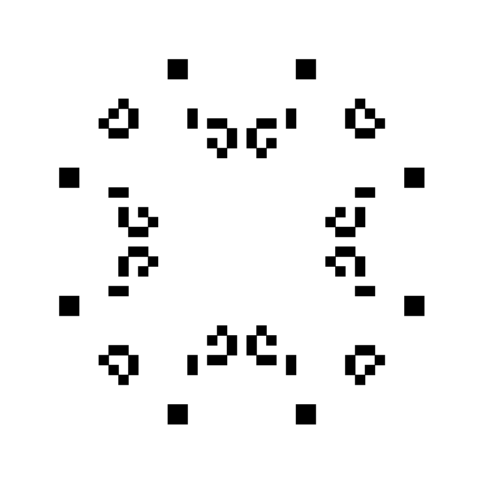
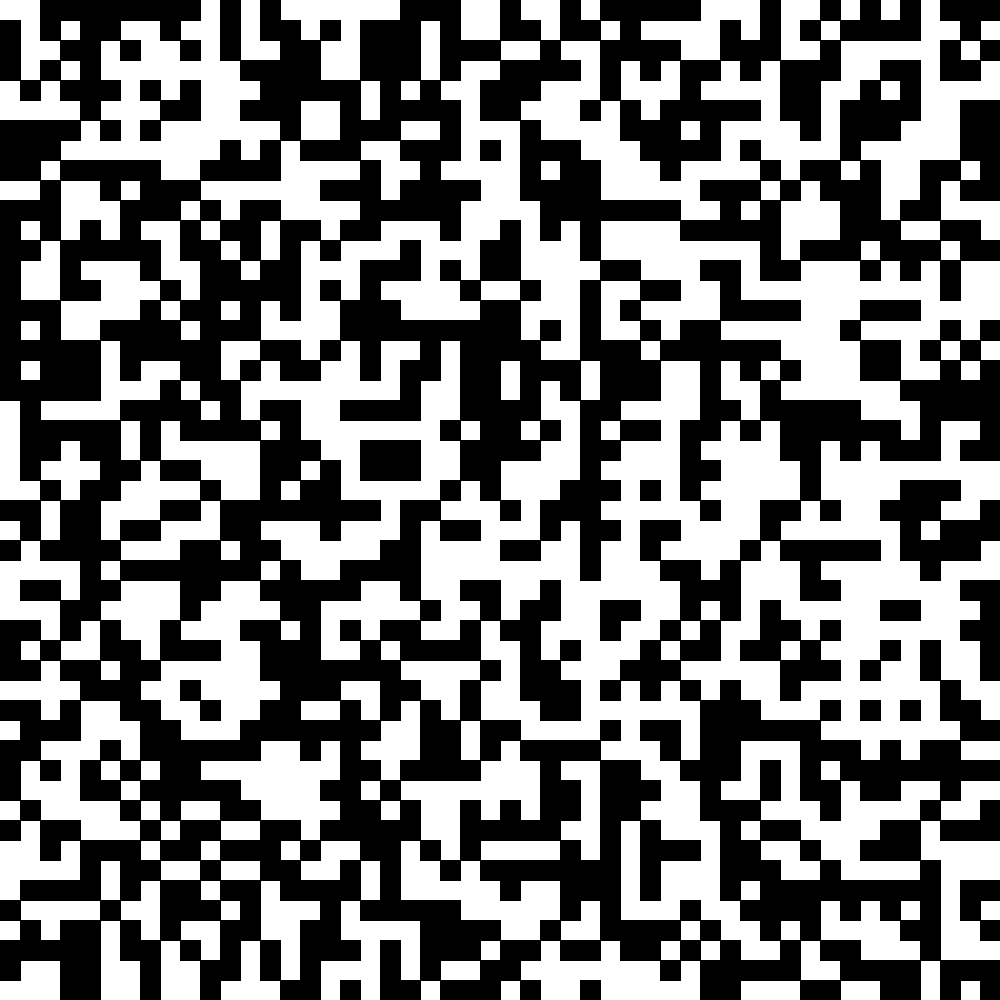

# game-of-life-python

John Conway's Game of Life implemented in Python

The Game of Life is a cellular automaton, and was invented by Cambridge mathematician John Conway. It consists of a grid of cells which, based on a few mathematical rules, can live, die or multiply. Depending on the initial conditions, the cells form various patterns throughout the course of the game. 

## Rules

1. For a space that is populated:
    1. Each cell with one or no neighbors dies, as if by solitude.
    2. Each cell with four or more neighbors dies, as if by overpopulation.
    3. Each cell with two or three neighbors survives.
2. For a space that is empty or unpopulated:
    1. Each cell with three neighbors becomes populated.

## Life Lexicon

Initial configurations which make the game keep forever

1. Beluchenko's p37

2. Gabriel's p138

3. Random

## Future Work

* RGB implementation
* More Life Lexicon
